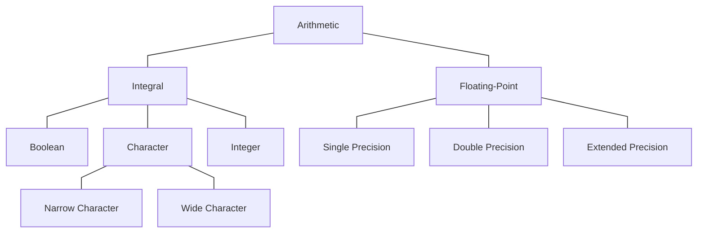

## Comments
Comments are used for in-code documentation. C++ supports both single-line and multi-line comments.

```cpp
/* multi-line comment */
// single-line comment
```

## Data Types
C++ has two broad categories of data types: fundamental types (those that are built into the language) and compound types (those that are defined in terms of another type). The fundamental types include the arithmetic types, the void type, and the null pointer type.



The arithmetic types are divided into two categories: integral types (which include the boolean type, character type, and integer type) and floating point types. The size of the arithmetic types varies across machines, but the standard guarantees a minimum size.

| **Type**      | **Meaning**                       | **Minimum Size**      |
| ------------- | --------------------------------- | --------------------- |
| `bool`        | boolean                           | NA                    |
| `char`        | character                         | 8 bits                |
| `wchar_t`     | wide character                    | 16 bits               |
| `char16_t`    | Unicode character                 | 16 bits               |
| `char32_t`    | Unicode character                 | 32 bits               |
| `short`       | short integer                     | 16 bits               |
| `int`         | integer                           | 16 bits               |
| `long`        | long integer                      | 32 bits               |
| `long long`   | long integer                      | 64 bits               |
| `float`       | single-precision floating-point   | 6 significant digits  |
| `double`      | double-precision floating-point   | 10 significant digits |
| `long double` | extended-precision floating-point | 10 significant digits |

Except for `bool` and the wide character types, the integral types may be signed or unsigned. The integer types (`short`, `int`, `long`, and `long long`) are all signed by default, while the signedness of `char` is implementation-defined.

These are a few rule of thumb to choose the data type:
- Use an unsigned type when you know that the values can not be negative.
- Use `int` for smaller data values and `long long` for larger data values.
- Use `char` and `bool` only to hold characters and truth values, respectively.
- Use `double` for floating-point computations.

## Literals
The default type of a character literal is `char`. However, this default type can be overridden by adding a prefix as listed in the table below:

| Prefix | Type       | Applicable To     |
| ------ | ---------- | ----------------- |
| `u`    | `char16_t` | character literal |
| `U`    | `char32_t` | character literal |
| `L`    | `wchar_t`  | character literal |
| `u8`   | `char`     | string literal    |

The default type of an integer literal is `int`, while the default type of a floating-point literal is `double`. These default types can be overridden by adding a suffix as listed in the table below:

| Suffix       | Type          | Applicable To           |
| ------------ | ------------- | ----------------------- |
| `u` or `U`   | `unsigned`    | integer literals        |
| `l` or `L`   | `long`        | integer literals        |
| `ll` or `LL` | `long long`   | integer literals        |
| `f` or `F`   | `float`       | floating-point literals |
| `l` or `L`   | `long double` | floating-point literals |
